# Vision Transformer XAI

## Introduction

Recent developments in the field of deep learning have led to neural networks becoming bigger and more complex. These gigantic models, consisting of up to billions of parameters, are hard to understand and are therefore often seen as black boxes that hide their inner reasoning from the human interpreter. If such models are used in real world applications, it is especially crucial to make sure that the models are working as they are supposed to. Therefore, Explainable AI (XAI) is needed to gain insights into the inner workings of a Deep Neural Network, gain trust and improve the reliability. [9]

    <figure>
        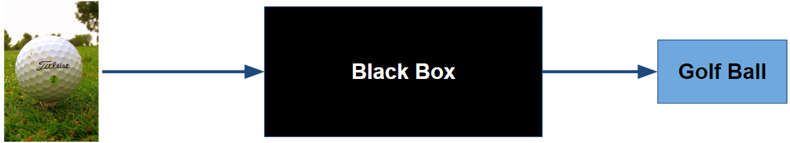
        <figcaption>Black Box Classification Model</figcaption>
    </figure>

One model that stands out among the mass of network architectures is the Transformer [11]. It is the basis for most Large Language Models and, therefore, has a significant impact on natural language processing. [7] The Transformer architecture was modified to work in the computer vision domain in the form of the Vision Transformer (ViT) by Dosovitskiy et al. in 2020. It has been shown that the ViT is able to outperform Convolutional Neural Networks, the former State-of-the-Art in Computer Vision. Nevertheless, practicioners and researchers have not been able to completely understand the reasoning of ViTs yet. That is why it is important to investigate explainability methods for the Vision Transformer. [7]

## Background

Before we jump right into our project idea and the conducted experiments, we will first have a look at the necessary background information to understand all concepts.

### Transformer

Transformers are one of the most successful architectures in deep learning at the moment and are the basis for the majority of Large Language Models and other model types. Given a sequence of input tokens, the Transformer aims to predict the probability distribution of tokens step by step. It is an autoregressive model, meaning that at each step, it can use all of the previously generated symbols.

    <figure>
        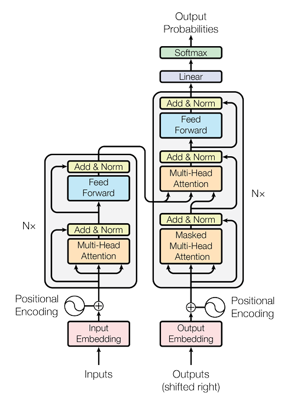
        <figcaption>Transformer Architecture [11]</figcaption>
    </figure>

Transformers consist of an **encoder** (have a look at the left side of the model architecture) and a **decoder** (right side of the model architecture). This model was invented for the processing of text. Therefore, the input consists of a sequence of text tokens. These tokens are linearly embedded into **input embeddings**, to which a **positional encoding** is added before going into the encoder. This information is needed so that the Transformer can know the order in which the tokens are presented.

The encoder consists of identical, stackable blocks. These blocks include **Multi-Head Self-Attention**, which enables the Transformer to focus on different parts of the sequence for each token, followed by a fully-connected feed-forward network. These two parts of the block are used in residual connections and are followed by layer normalization. The information of this block is used to enrich the token embeddings and model long-range dependencies.

    <figure>
        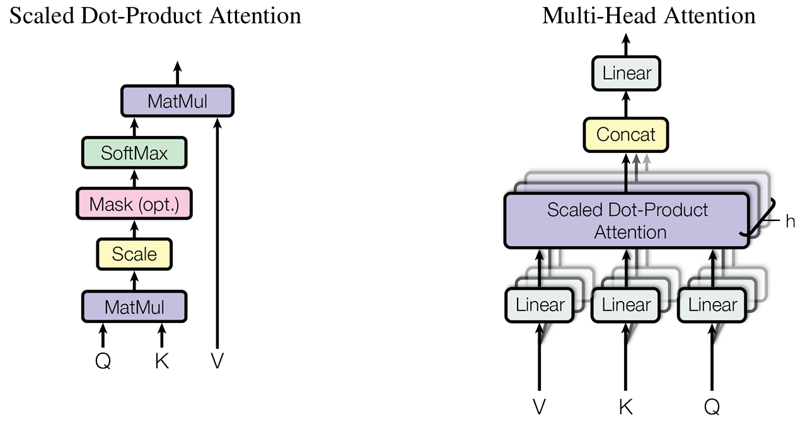
        <figcaption>Scaled Dot-Product Attention (left) and Multi-Head Attention (right) [11]</figcaption>
    </figure>

But how does the attention work? Let's first have a look at **Scaled Dot-Product Attention**. For this, we need Queries Q and Keys K. The Queries represent the tokens we are processing at the moment. To enrich the token embeddings with useful information, we need to find Keys (also representations of tokens) that match the Queries. Therefore, we calculate the Dot Product between Queries and Keys as a kind of similarity measure and then scale the result by dividing through their dimension $d_k$. After that, softmax is applied which gives us attention values. Then, these attention values are multiplied by the Values V to gain a new representation.

$Attention(Q,K,V) = softmax(\frac{QK^T}{\sqrt(d_k)})V$

Now, we can explain how the Multi-Head Attention works. Instead of having just one perspective or one set of attention values, the Transformer uses Multi-Head Attention. The Transformer learns a set of linear projections of Queries, Keys and Values to get different versions of each. Then, the Scaled Dot-Product Attention is applied such that each **head** can focus on different aspects of the sequence. The results are then concatenated and followed by a linear layer.

$MultiHead(Q,K,V) = Concat(head_1,...,head_h)W^0$ where $head_i = Attention(QW_i^Q, KW_i^K, VW_i^V)$. $W_i^Q, W_i^K, W_i^V$ are the projection parameter matrices and $W^0$ the parameters of the last linear layer.

In the encoder, Queries, Keys and Values all come from the previous layer encoder output.

On the right side for the decoder, the outputs are again embedded and enriched with a positional encoding before they are given to the decoder. Similarly to the encoder, the decoder consists of stackable blocks, which make use of Multi-Head Attention. Nevertheless, there are two differences to the encoder: the first Multi-Head Attention of the decoder is **masked** to make sure, that the Transformer does not use information about the "future" from the already available correct sequence in training to predict the next token. Also, following the Masked Multi-Head Attention, a Multi-Head Attention connecting the encoder and the decoder is used to combine both paths. Here, the Queries come from the previous decoder layer while the Keys and Values come from the output of the encoder.

After the processing of all decoder blocks, a linear layer followed by a softmax layer is used to produce output probabilities for the following text tokens.

### Vision Transformer

    <figure>
        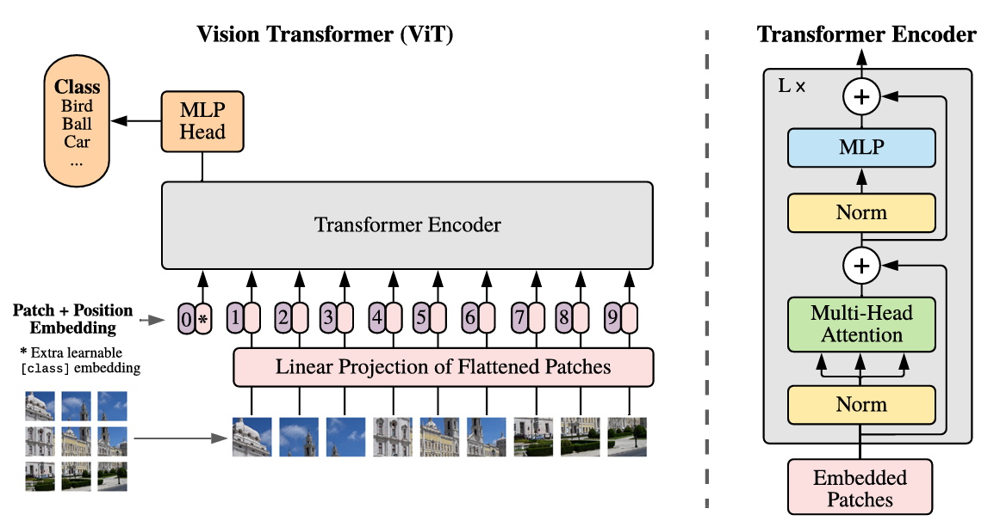
        <figcaption>Vision Transformer Architecture [4]</figcaption>
    </figure>

The Vision Transformer (ViT) is an application of the Transformer architecture to computer vision. For this, the input image is split into **fixed-size patches**. Each image patch is linearly embedded to receive patch embeddings, to which a positional embedding is added. The resulting sequence can then be given as input to a standard Transformer encoder. These image patches are treated similarly to tokens in NLP applications. Additionally, an extra learnable **classification token** is concatenated to the sequence and later used in an additional MLP head for classification tasks.

### Attention Rollout

Attention Rollout is an explainability method for Transformers. [1] It uses the attention weights in all layers to approximate the attention to the input tokens. A common explainability method is to simply visualize the attention weights. But this approach has disadvantages: In higher layers, the attention values do not exactly correspond to the input tokens, leading to a difficult token identifiability. Therefore, Attention Rollout has been introduced.

Attention Rollout assumes that the input tokens are linearly combined based on attention weights. Starting from the last layer, they roll out the attention to capture the propagation of information while also taking the residual connections of the Transformer into account.

$\tilde A(l_i) = \begin{cases} A(l_i)\tilde A(l_{i-1}) &  i>j \\ A(l_i) &  i=j \end{cases}$, where $i$ starts at the last layer and decreases stepwise by one and $j$ denotes the layer until which we want to roll out. 

For the first layer, the raw attention values are set as the Attention Rollout matrix. For the following layers, we obtain the Attention Rollout by recursively multiplying the attention values of the specific layer by the Attention Rollout of the lower layer.

The residual connections are taken into account by adding an identity matrix to the attention matrix and re-normalizing the weights:

$A = 0.5W_{att} + 0.5I$, where $W_{att}$ is the attention matrix and $I$ an identity matrix.

The method results in a new set of attention weights that can be used as a diagnostic tool in analyses.

## Motivation

Available Explainable AI methods can be classified into **local and global explanations** based on the scope of the intepretation. [5] **Local interpretations** analyze individual predictions & decisions of a model. We could, for example, explain how a model sees and interprets a single image and which pixels are contributing to the prediction of a specific class. In general, there exists a variety of methods concerning local interpretability of (deep) neural networks, including GradCAM [8], LRP [2], and Integrated Gradients [10], each with its own advantages and disadvantages. 

    <figure>
        
        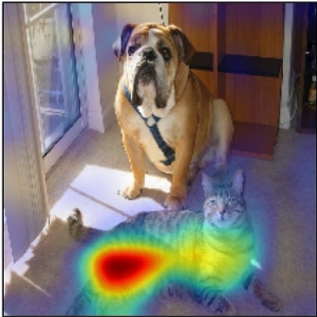
        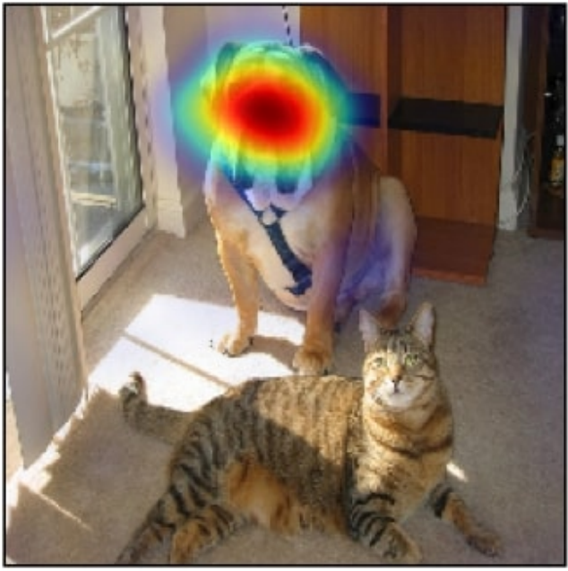
        <figcaption>Application of GradCAM on original image (left) for class Cat (middle) and class Dog (right) [8]</figcaption>
    </figure>

Most of these techniques have been developed for application to CNNs and do not take into account the unique inner workings of the Transformer. This is why applying them to the (Vision) Transformer is challenging and often does not work as expected.

Hence, new methodologies have been developed explicitly for Transformers. They take, for example, the attention values resulting out of the Multi-Head Self Attention into account. One such method is **Attention Rollout**, which we have already described in the background section above. The information from local interpretations like Attention Rollout is already useful on its own, but we want to incorporate it into a global approach.

**Global interpretations** analyze a specific model at a broader level and provide an overall analysis of the model and its general behavior. There has been little research in representational analyses for ViTs, which is why we explore this direction with our experiments. We aim to analyze how ViTs process similar images, specifically, images of a particular concept, and how the information is represented in the intermediate layers. Although there has not been much research on this topic for ViTs, the idea of analyzing the representation of concepts is not new.

    <figure>
        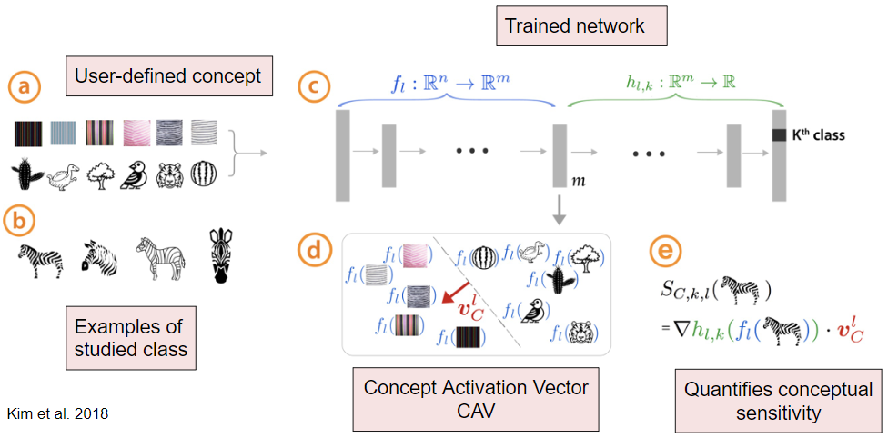
        <figcaption>Testing with Concept Activation Vectors [6]</figcaption>
    </figure>

The method *Quantitative Testing with Concept Activation Vectors* (TCAV) aims to use directional derivatives to quantify the degree to which a user-defined concept is important to a classification result. [6] For this, they first define a concept by grouping images representing the main idea behind the concept (a). Then, they calculate a Concept Activation Vector (CAV), which is a vector pointing to the direction of the values of a concepts set of examples (d) obtained from a trained neural network (c). This CAV can then be used to quantify the conceptual sensitivity (e) for examples of the studied class (b). TCAV uses hidden layers of "classical" neural networks and has not been applied to Transformers yet.

Unlike TCAV, we want to calculate concept representations as average concept embeddings and also use local information from, for example, Attention Rollout. Our approach will be discussed further in later sections. Our **goal** is to globally analyze the Vision Transformer to make predictions about whether the similarity of concepts agrees with human intuition. Our methodological approach and aims will be presented in the following sections.

## Methodology

### Model & Dataset

To perform our experiments and analyze the intermediate representations of a Vision Transformer, we have decided to use a pretrained ViT model. The [*google/vit-base-patch16-224*](https://huggingface.co/google/vit-base-patch16-224) is pre-trained on ImageNet-21k at a resolution of 224x224 pixels and fine-tuned on ImageNet 2012 at a resolution of 224x224 pixels. The input images are split into a sequence of fixed-size patches with a resolution of 16x16 pixels.
The model consists of 12 Transformer encoder layers with 12 attention heads in the Multi-Head Attention and an embedding vector size of 768 dimensions. 

As a dataset, we chose the [*frgfm/imagenette*](https://huggingface.co/datasets/frgfm/imagenette) dataset from Hugging Face. It consists of a smaller subset of 10 easily classified classes from ImageNet. These classes are: Tench fish, English Springer Spaniel dog, cassette player, chain saw, church, French horn, garbage truck, gas pump, golf ball, and parachute. We are using this smaller version instead of the full ImageNet dataset for computational effort reasons, as it would be costly to use all classes and images of that dataset to perform the following analyses. Additionally, only few classes and images are needed to demonstrate our technique.

### Analyzing Concepts

In the following, we want to switch the focus from analyzing single images to concentrating on concepts. For our experiments, we use 20 exemplary images of each class to form concepts.

    <figure>
        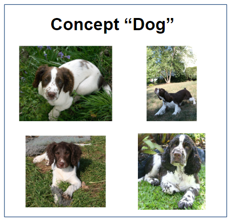
        <figcaption>Exemplary Concept "Dog"</figcaption>
    </figure>

We want to calculate an average embedding (concept embedding) that represents all images of a concept to enable further analyses. A first approach would be to take examplary images of a concept, split these into patches and insert the sequences into the ViT. Each image consists of $14\times14 = 196$ patches. With the additional class token (CLS) we reach a total of 197 tokens, where each token gets a 768-dimensional embedding from the ViT. We could then average over all patches of an image, followed by an average over all images of a concept to gain a concept embedding for a selected class (see figure below).

    <figure>
        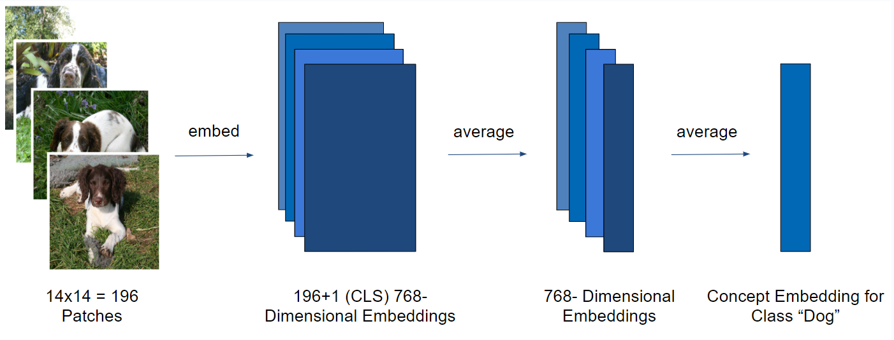
        <figcaption>Basic Concept Embedding</figcaption>
    </figure>

With this simple approach, we are averaging over all patches to calculate our concept embedding. Usually, an image is consisting of the object in focus and a background. Let's take a look at two images from the dataset:

    <figure>
        
        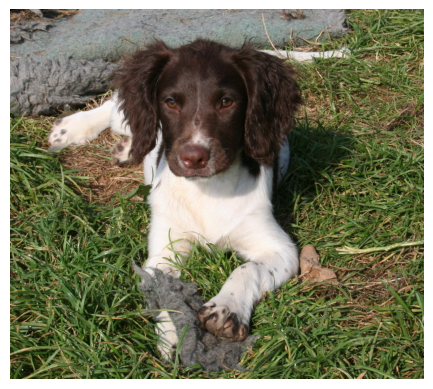
    </figure>

Here, we can see a golf ball image and an image of a dog. The objects are centered in the middle and both images share a grassy background. Let's imagine that these images are representative of the concepts "golf ball" and "dog". In this case, the concept embeddings of these two concepts would be relatively similar just because of the similar background. Ideally, we would only like the concept embeddings to be similar if the main aspects of the concepts are similar. That's why it makes sense to just average over the "relevant" patches for a concept. This brings us to the question of what "relevant" means in this context.

### Patch Relevance

To find the most relevant patches of a concept and calculate the average embedding, we define patch relevance by using different sources of information: Attention, Gradient & Embedding

The attention values in a layer measure how much focus each token is giving to the other tokens in the sequence:

- One variant is to look at the raw **attention** values. For this, we use the attention values at specific layers of the CLS token and take the mean over the different attention heads. The task of the CLS token is to summarize the relevant information needed for the down-stream classification task. Therefore, we assume that the attention of the CLS token to the other tokens can be interpreted as a relevance measure for our concepts. 

    <figure>
        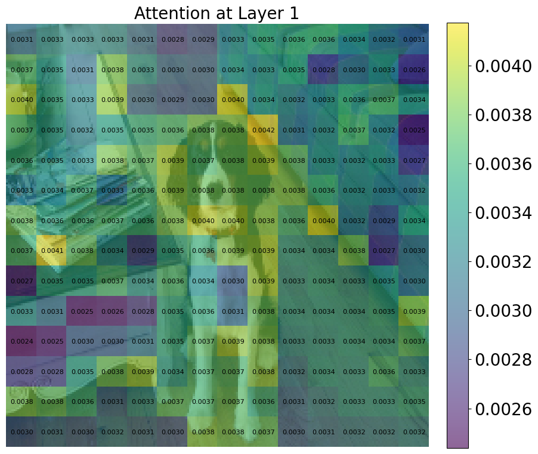
        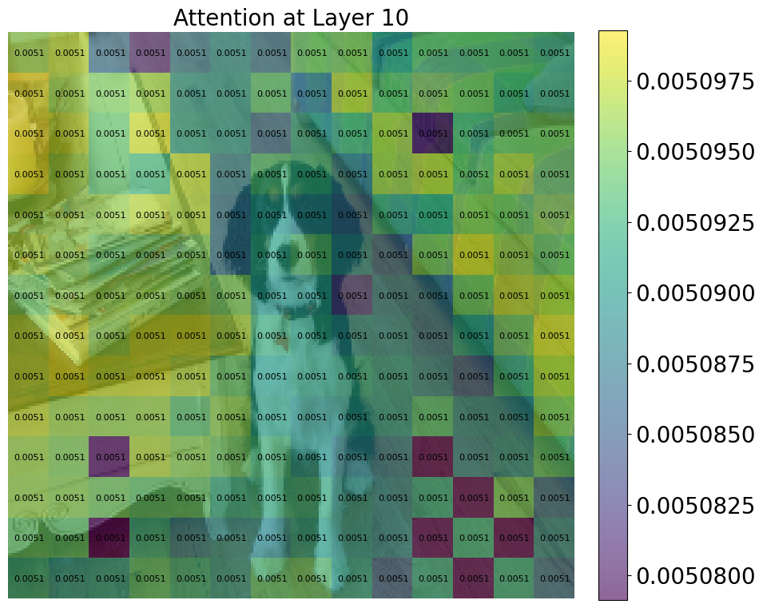
        <figcaption>Attention Relevance for an Examplary Image of Concept "Dog"</figcaption>
    </figure>

- Since the attention values alone are not taking the residual connections and the redistribution of the information between the layers of a Transformer into account, a second variant is to use **Attention Rollout** values. Again, we are focusing on the values between the CLS token and all the other tokens in a specific layer averaged over the different attention heads.

    <figure>
        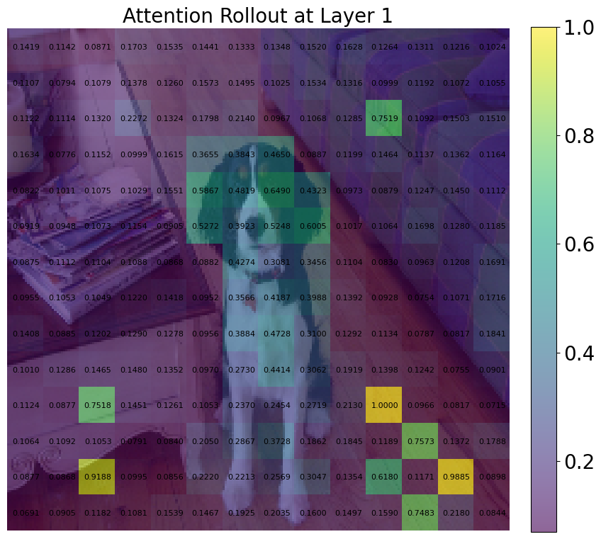
        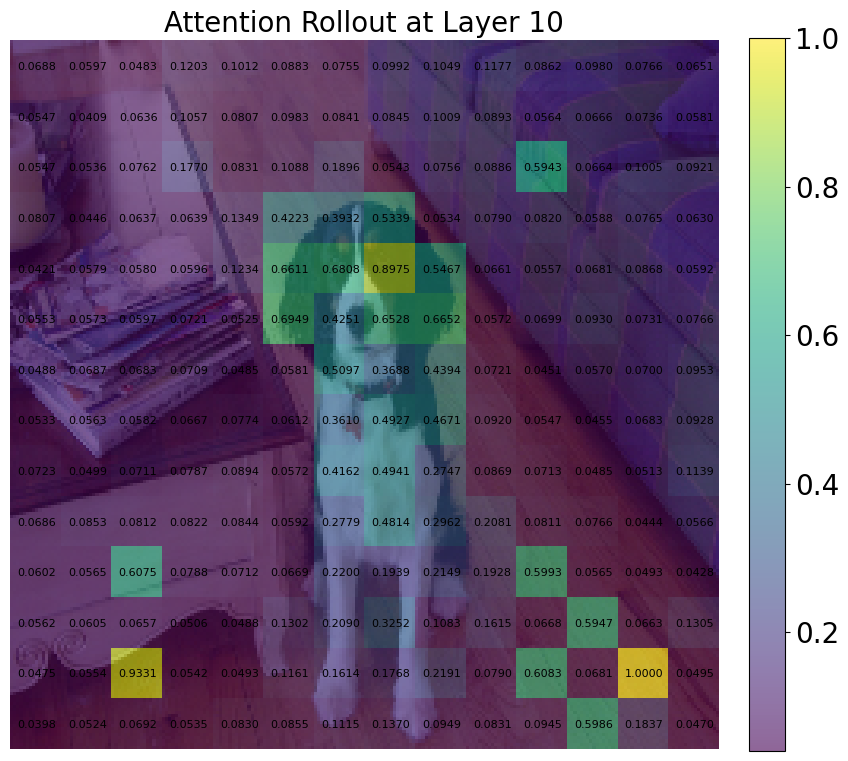
        <figcaption>Rollout Relevance for an Examplary Image of Concept "Dog"</figcaption>
    </figure>

- The third approach is to go away from the CLS token and use the attention values between the other patch tokens. Even though the CLS token is ultimately used for classification, it does not necessarily mean that it alone captures relevant information about the input. That's why we look at the **aggregated attention values** over all heads for each token (excluding the CLS token). The result is a measure of how much all of the other tokens are attending to a specific token at a specific layer.

    <figure>
        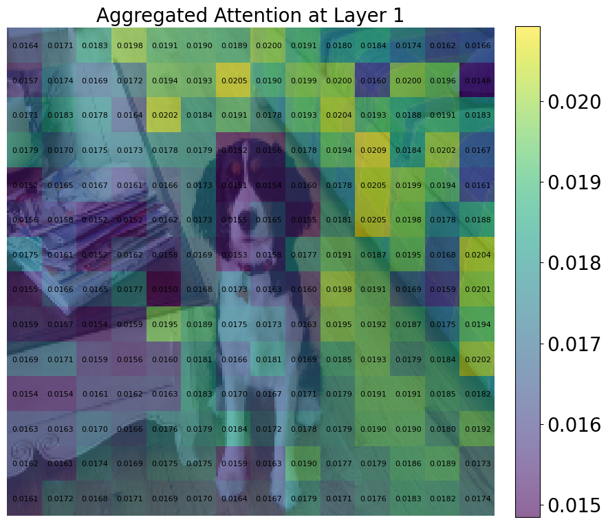
        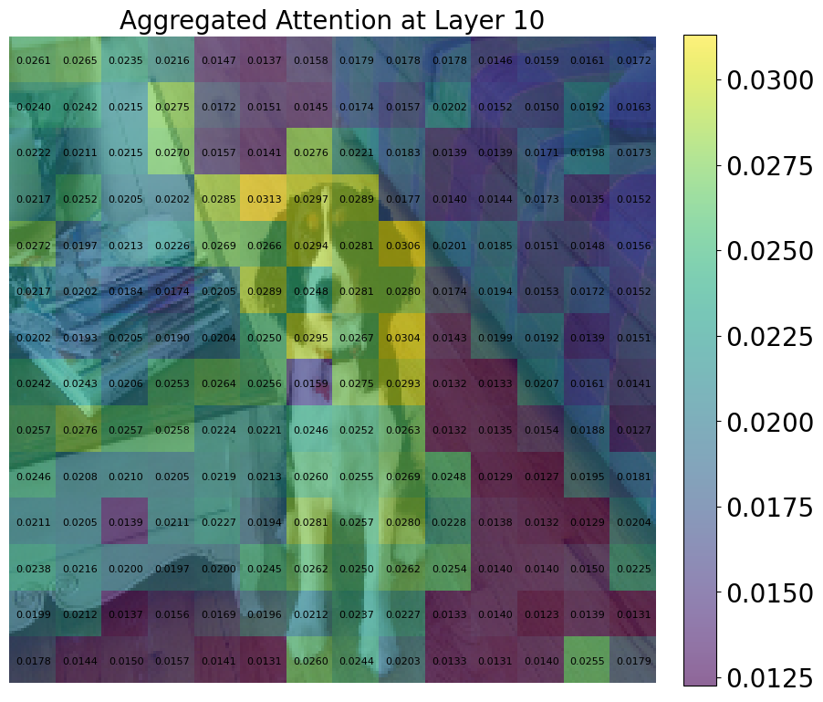
        <figcaption>Aggregated Attention Relevance for an Examplary Image of Concept "Dog"</figcaption>
    </figure>

Gradient information is often used in XAI techniques in computer vision to analyze the importance of specific pixels for a prediction. In our case we want to use gradient information to get the relevance of a whole image patch at a specific layer. Therefore, we calculate the gradient of the logits of a model prediction with respect to the patch embedding at a specific layer. Moreover, we only focus on the positive contribution and ignore negative gradients by setting them to zero. After that, we average the gradient information for a token over all 768 dimensions to reach a single **gradient relevance** per image patch.

    <figure>
        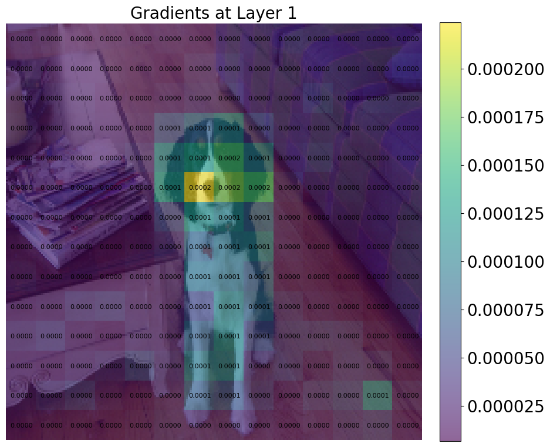
        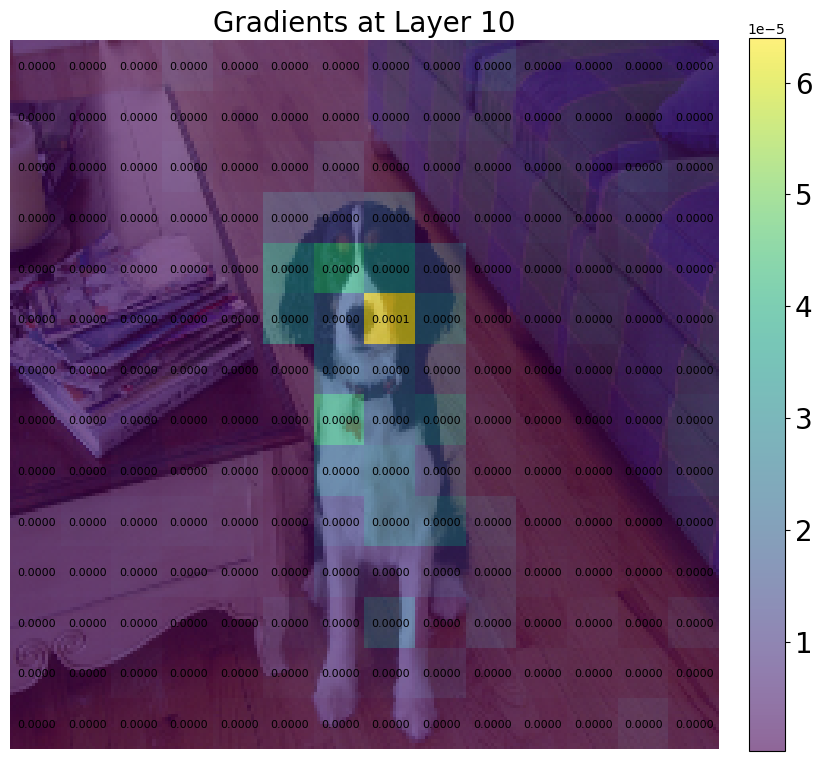
        <figcaption>Gradient Relevance for an Examplary Image of Concept "Dog"</figcaption>
    </figure>

Lastly, we also have a look at the embedding values itself to define **embedding relevance**. We extract the 768-dimensional embeddings of the 197 patches from an image at a specific layer. After the exclusion of the CLS token, for each patch the maximum of the 768 absolute values is calculated. Hereby, we follow the idea that embeddings, which differ strongly from the null-vector, should be highly informative about the processed image.

    <figure>
        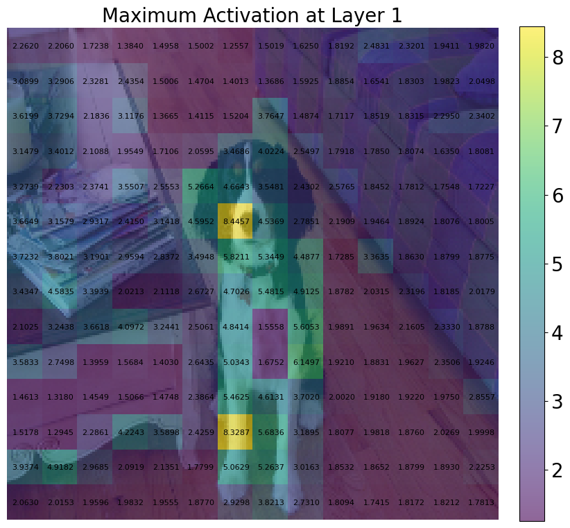
        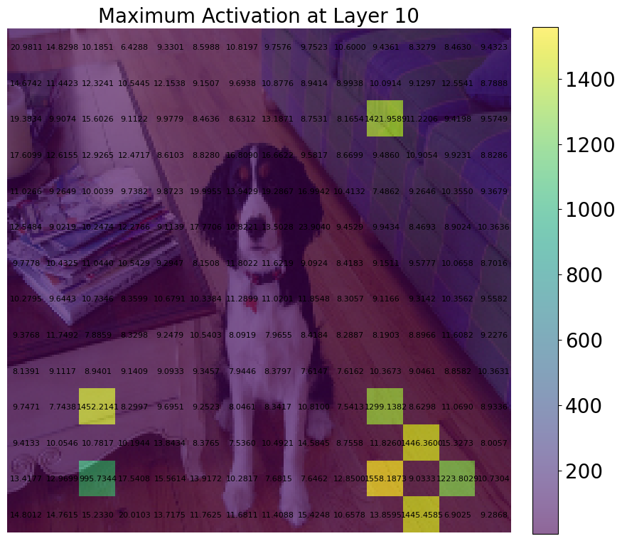
        <figcaption>Embedding Relevance for an Examplary Image of Concept "Dog"</figcaption>
    </figure>

### Concept Embeddings

Now that we have different approaches of defining patch relevance, let's see how we can use patch relevance values to calculate a concept embedding which focuses on the relevant patches of an image.

    <figure>
        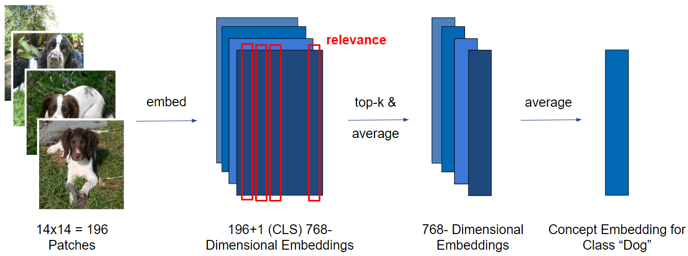
        <figcaption>Concept Embedding with top-k Patch Selection</figcaption>
    </figure>

Just as in the basic approach, we take 20 exemplary images of a concept, which get split into $14\times14 = 196$ patches each. With the additional CLS token, all patches get embedded into 768-dimensional embeddings. Next, we select a patch relevance approach to get the relevance values and then rank the resulting relevances for all tokens per image. The ranking can afterwards be used to only select the top-k most relevant patches per image for an image embedding. Finally, the image embeddings are averaged to produce a single concept embedding consisting of 768-dimensional values. The aim of this adjustment is to get concept embeddings representing the main features of the concept. 

### How Many Patches do we Select?

Even though we now have explained how to get to the concept embeddings, theoretically, we still have to determine a parameter to actually use this approach for further experiments. As can be seen in the figure above, we have not talked about how many patches we should ideally select in the top-k relevance selection. There are two different forces leading the determination of the parameter k:

1. We want to select as many patches as needed to capture the pixel information concerning the concept.
2. We want to select as little patches possible to not include unrelated information concerning the concept, e.g. background information.

To select a value for k, we conducted an experiment. First, we used the ViT to predict the class of all 20 exemplary images of the 10 selected concepts. Then, we obtained the top-k most relevant patches per images as described above for the k values $k = [1,2,4,8,16,32,64,128,196]$, for each patch relevance approach. 

    <figure>
        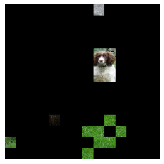
        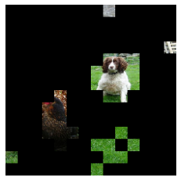
        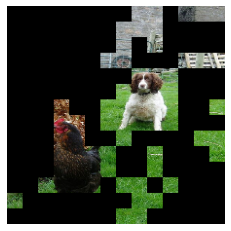
        <figcaption>Occlusion with Attention Rollout and k=16 (left), k=32 (middle) and k=64 (right)</figcaption>
    </figure>

In the second part of the experiment, we masked the original images such that only the selected patches contain the actual pixel values while the other pixels are set to the default value 0. These modified images were then inserted into the ViT again while simultaneously monitoring the development of the prediction accuracy of the model.

    <figure>
        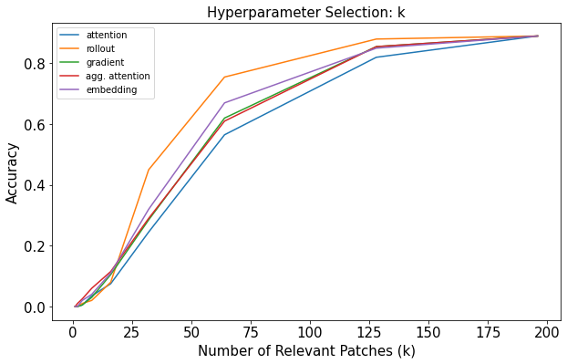
        <figcaption>Results of our Occlusion Experiment to Determine k Using Relevance in the Input Layer</figcaption>
    </figure>

The diagram above shows the results of our experiment. It displays the growth of the accuracy depending on the amount of selected relevant patches (k). K ranges from selecting only the most relevant patch to selecting all patches, which is the same as not masking the image at all. We can see that the accuracy increases with the amount of selected patches. This makes sense, because the ViT can use more information of the image to make a grounded decision. For a low number of k, the steepness of the curve is higher than for higher numbers of k. After around 50 patches, we are already able to achieve relatively high accuracy with a patch relevance approach like Rollout, which does not improve significantly beyond this point. This tells us, that not all patches of an image are necessary to predict the depicted class. Since the accuracy is already usable and the performance gain from selecting more patches is not very high, we select $k=50$ for our further experiments. This also allows us to fulfill the two requirements for determining the parameter k, which we defined above.

## Experiments

Up until now, we have found a way to calculate concept embeddings that represent the relevant aspects of concepts. We can use these concept embeddings to compare concepts and test whether intuitively similar concepts also share similar embeddings. We could, for example, ask whether the concepts "Dog" and "Fish" are more similar than "Dog" and "Truck," since concepts of animals might be closer than those of an animal and a vehicle.

    <figure>
        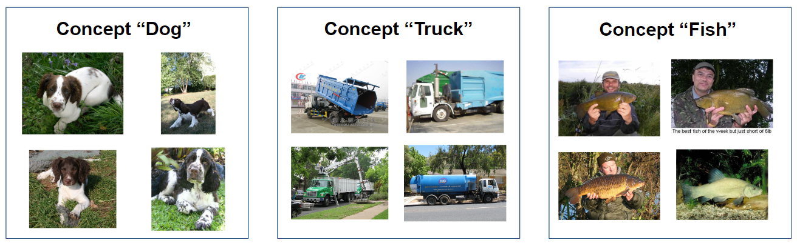
        <figcaption>Exemplary Concepts "Dog", "Truck" and "Fish"</figcaption>
    </figure>

To calculate the distance between concept embeddings we need to decide which distance or similarity metric we want to choose. Usually, there are three common metrics for the comparison of numerical vectors: Sum of Squared Errors (SSE), Cosine Similarity & Dot Product Similarity. Let $x, y \in \R^{768}$ be two concept embeddings.

- **SSE**: $d(x,y) = \sum_i (x_i - y_i)^2$  
This distance measure can be used to measure how far two vectors are apart from each other and works in a range of $[0,\infty)$, where smaller numbers mean a higher similarity and bigger numbers lower similarity. The SSE is tightly coupled to the euclidean distance: $d_2(x,y) = \sqrt {SSE(x,y)}$

    <figure>
        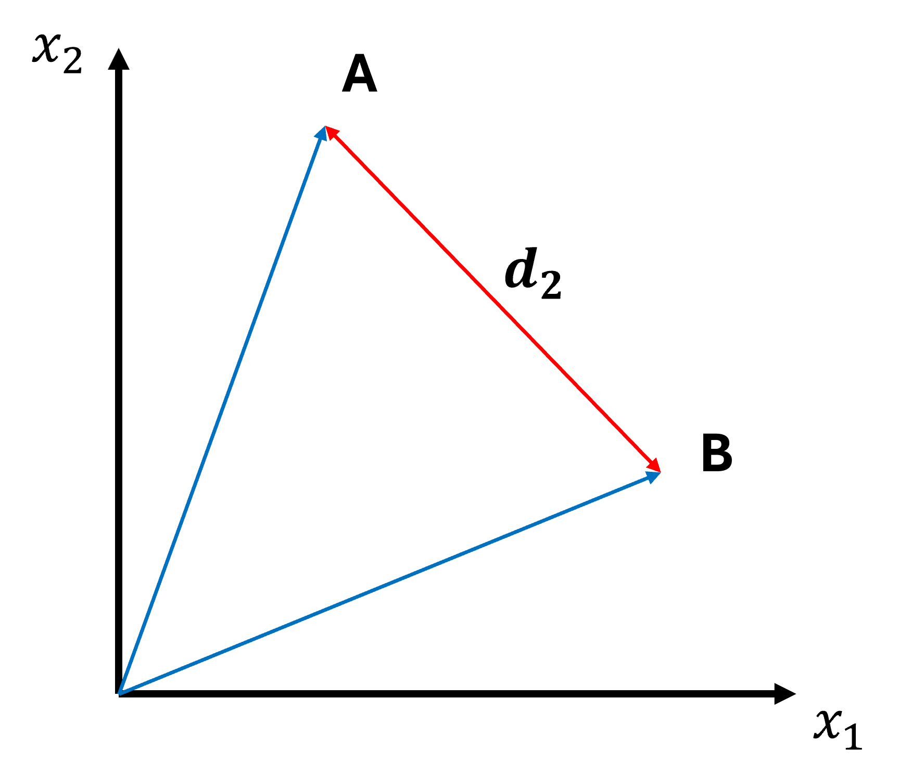
        <figcaption>Euclidean Distance Between two Vectors</figcaption>
    </figure>

- **Cosine Similarity**: $sim(x,y) = cos(\theta) = \frac{x * y}{\|x\| * \|y\|}$  
Cosine Similarity measures how similar two vectors are by computing the cosine of the angle between them. It ranges between [-1,1], where a similarity of 1 corresponds to vectors pointing in the same direction, a similarity of -1 to vectors pointing in opposite directions, and a similarity of 0 to orthogonal vectors.

    <figure>
        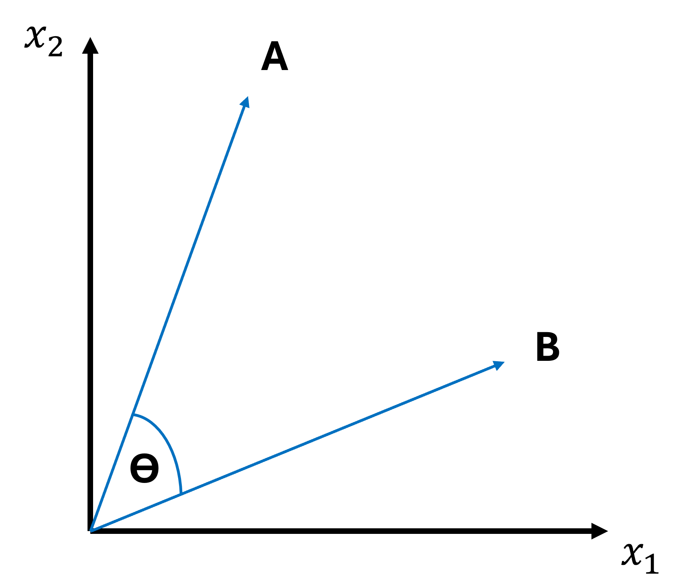
        <figcaption>Angle Between two Vectors</figcaption>
    </figure>

- **Dot Product Similarity**: $sim(x,y) = \|x\| \|y\| cos(\theta) = xy = \sum_i x_i y_i = x_1 y_1 + x_2y_2 + ... + x_ny_n$  
Dot Product Similarity is closely related to Cosine Similarity, as it also works with the cosine of the enclosed angle between two vectors. The difference is that, unlike Cosine Similarity, the Dot Product is not scaled by the magnitudes of the vectors. Therefore, the Dot Product has a range of $(-\infty,+\infty)$. Negative values correspond to opposing directions, positive values to the same direction and a value of 0 again shows orthogonality.

We can use these distance and similarity measures to compare the selected concept embeddings. First, let's look at the comparison between the concepts "Dog" and "Fish". In this experiment, we also distinguish between different variants of concept embeddings as a result of the five patch relevance selections we defined earlier. The legend indicates which color corresponds to each patch selection method. "Basic" patch selection corresponds to the basic approach of calculating a concept embedding, including all patches.

    <figure>
        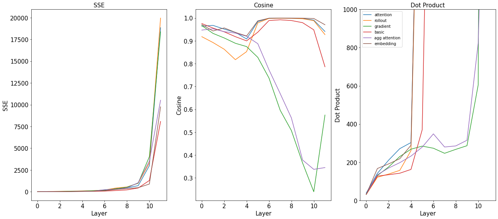
        <figcaption>Distance Between Concept Embeddings for "Dog" and "Fish"</figcaption>
    </figure>

The figure above consists of three plots. The left diagram shows the SSE between different concepts at each layer of the ViT. The middle diagram shows the Cosine Similarity for each layer, and the right one is about Dot Product Similarity.

1. The higher the layer, the more different the concept embeddings seem to be. This is evident from the increasing SSE (distance) and the decreasing Cosine Similarity.

2. We can find patch selection approaches for each metric, which perform better in distinguishing the concepts than the basic approach.

The experiment shows that we are able to use different variants of concept embeddings to compare the similarity of concepts at different layers of the ViT. Nevertheless, we have to think about the validity of the results. For example, the plots show a significant increase in the SSE between concept embeddings in the later layers. The SSE is dependent of the absolute embedding values. Could it be that we are only reaching high SSE values because the absolute embedding values are increasing with each layer?  That is why we decided to examine the norm of the embedding values themselves (exemplary for the concept "Fish").

    <figure>
        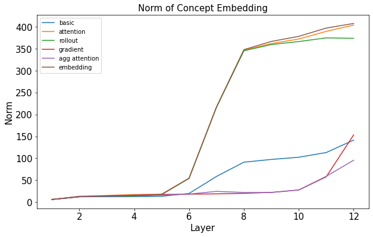
        <figcaption>Norm of the Concept Embedding "Fish"</figcaption>
    </figure>

In the diagram above, we can see that the norm of the patch embedding values increases with each layer in the ViT. That means that the model is processing the information of an image in such a way that it puts higher values into the embeddings with increasing layers. Also, we can see two groups forming: concept embeddings with gradient and aggregated attention patch selection, as well as those with no patch selection, have significantly lower norms than those with rollout, attention, and embedding patch selection. This might be caused by the initial selection of relevant patches. The embedding values of the chosen patches influence the development of the norm of the embeddings in the following layers. Nevertheless, the increasing norm of the concept embeddings is visible in all analyzed variants. At this point, we cannot be sure how significant the impact of this effect is on the between-concept distance experiment. To mitigate this effect, we will try to scale the distance and similarity measures.

Therefore, in the next experiment, we will calculate the scaling factors for each layer. For this, we extract the embedding values of all 20 examples per concept for each layer. Then, we take the norm of the 768-dimensional values and take the average over all patches, examples, and concepts to have a resulting scaling vector of 12 values. The following plot shows the development of the scaling factor per layer.

    <figure>
        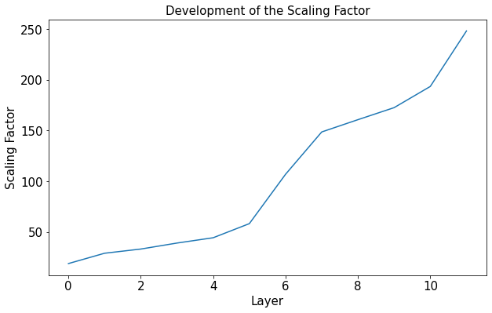
        <figcaption>Development of the Scaling Factor</figcaption>
    </figure>

We can use these scaling factors to scale the calculated distances/similarities between our concepts. To do this, we divide the values at a specific layer by $scale^2$ to keep up with the quadratic aspect of SSE and Dot Product. Nevertheless, we do not scale the Cosine Similarity because this measure is already incorporating a scaling by the norm in the original formula. The scaled comparisons of the concept embeddings "Dog" and "Fish" now look like the following:

    <figure>
        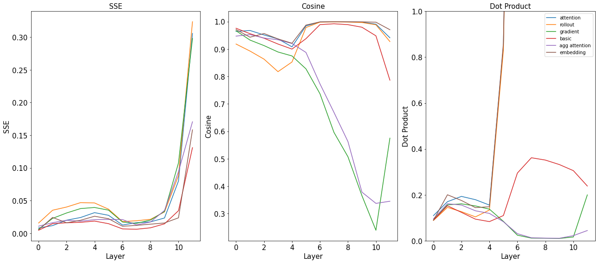
        <figcaption>Scaled Distance Between Concept Embeddings for "Dog" and "Fish" (Dot Product: y-axis cropped to 1 for better resolution in lower values)</figcaption>
    </figure>

The absolute values of the metrics are now smaller than before due to the scaling, but the general trend remains the same. 

The increasing distinguishability of concept embeddings can be explained by the processing of information in a ViT. At the beginning, in the first layers, not much processing has been conducted to enrich the representations with global information. The higher the layer, the more information about the key features of the concepts can be used in the concept embeddings. As a result, the concept embeddings start to differ more and become more distinguishable in higher layers.

The second trend we can observe is the better distinguishability of concept embeddings of some patch selection methods in comparison to our basic approach. The patch selection is aiming to choose patches displaying the defined concept. The basic approach that uses all patches to create a patch embedding therefore also incorporates patches concerning the background. That is why concepts may be not as easily distinguishable with this approach if they share similar image features in the background.

Until now, we have not really talked about the plots for Dot Product Similarity. For some patch relevances we can observe a higher dissimilarity, a lower Dot Product for higher layers (e.g. gradient or aggregated attention). Nevertheless, in some cases, the values of the Dot Product start to increase gradually with the layer and seem to jump to extremely high values. To still be able to analyze trends, we clipped the plot to a Dot Product of 1. As we have already shown, the absolute values of the embeddings in a ViT start to increase with the layer. We recognised this trend and therefore introduced the scaling of the distance and similarity measures. This seems to work well for SSE but not for Dot Product. But why is it like that? As we described above, the only difference between Cosine and Dot Product Similarity is the scaling in the Cosine formula. Shouldn't the Dot Product then behave similarly to Cosine? The Cosine is scaled by the product of the norms of both vectors $||x|| * ||y||$. Our introduced scaling factor leads to a scaling by the squared average norm. These scaling approaches are only leading to comparable results, if there is not much variation in the norm of the vectors. However, literature has shown that ViTs use only a handful of embeddings to which they assign comparatively high values to store information. [3] This means that we have a high variance in the norms of the embeddings used, which explains the divergent behaviour of the Dot Product. Therefore, we should avoid using the Dot Product to assess the similarity of our concept embeddings.

At the moment, we are looking at a variety of patch selection approaches and three different metrics for the comparison of concepts. Would it be possible to determine which combination of patch selection and metric is most suitable for comparing or distinguishing between our concepts?

    <figure>
        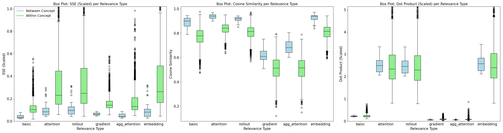
        <figcaption>Boxplots for SSE (left), Cosine (middle) and Dot Product (right)</figcaption>
    </figure>

The diagram above displays boxplots for our three chosen distance/similarity metrics: SSE, Cosine Similarity, and Dot Product. In each boxplot, we can observe the metrics behaviour depending on the patch relevance definition. In blue, we see values for between-concept distances, and in green, values for within-concept distances. The between-concept values were generated by averaging the metric values across layers, for all combinations of concept pairs. Our intention was to gain insight into the general trends in the metrics' behavior. The within-concept values correspond to the distance between all possible image pairs of a concept averaged over the layers, for all concepts.
As we have already discussed above, we want to use our metrics to distinguish between concept embeddings. To reach a higher distinguishability, the SSE should be as high as possible, and the Cosine and Dot Product as low as possible. Nevertheless, for our metrics and defined patch relevances to make sense, the within-concept distances (similarities) should be smaller (higher) than the between-concept distances. This is because images of the same concept should have more similar embeddings than images from different concepts.

When comparing the between-concept and within-concept distances, we see that the within-concept values are higher for SSE and lower for Cosine Similarity and Dot Product. This would mean that two images of the same concept are more dissimilar than the concept embeddings of two different concepts. This is contradicting one of the requirements we described above. One reason might be that the within-class values are computed for original image pairs while the between-class values are between concept embeddings. These might be smaller scale due to the averaging over the images. Another reason for this could lie in the chosen data. For the creation of our concepts, we used the **first 20 images** of the dataset that correspond to the same class. We did not manually select images that specifically looked alike. This could lead to high differences for specific image pairs in a concept. In each concept, among the 20 images we chose, there are some images where the concept object is not clearly visible or is partially covered by other items in the image.  For further analysis, it would be advisable to manually select images for the concepts and redo the experiments.

<!-- TODO: example of very dissimilar images -->

    <figure>
        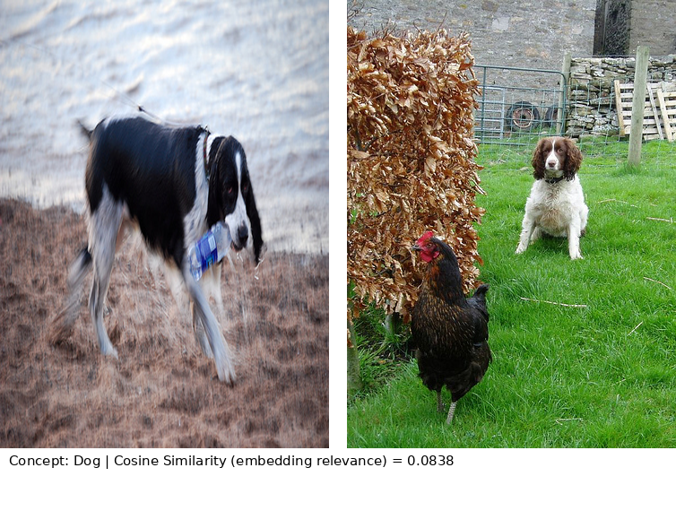
        <figcaption>Example of Very Dissimilar Images Within the Same Concept "Dog"</figcaption>
    </figure>

The two "Dog" concept images above are very dissimilar, with a low Cosine Similarity of 0.0838. This low similarity could be due to several factors. The image on the left is blurred, making it difficult to identify distinct features of the dog. Blurriness reduces the clarity of the concept, making it harder for the model to extract and compare relevant features between the two images. In the image on the right, the dog is positioned in the background and is relatively small. Also, other elements, such as the chicken, grass and leaves, are more prominent in the foreground. This prominence of unrelated objects in the image decreases the focus on the actual concept, leading to less relevant features being compared. These combined issues contribute to the low similarity score between the two images.  

Now we can analyze the actual between-concept distance values:

- Starting with the SSE, the patch relevance approach with the highest values is represented by Attention Rollout. Its box, which contains 50% of the data, is the highest, and its whiskers reach up the most. The high SSE values suggest that the Attention Rollout approach excels at distinguishing between concepts because it generates embeddings that are sufficiently distinct from each other, thereby increasing the between-concept variance. Therefore, the best patch relevance approach for the metric SSE is Attention Rollout.

- Next, let's analyze the boxplot for Cosine Similarity. Here, the values associated with the gradient relevance approach are significantly the lowest among all approaches. The box and whiskers are lower than those of the other patch relevance methods. The low values for Cosine Similarity indicate that the gradient relevance approach generates embeddings for different concepts that are less similar to each other, providing a more precise and less overlapping representation of different concepts. This is why gradient relevance is the preferred approach for Cosine Similarity.

Lastly, we could also have a look at the boxplot for Dot Product Similarity. Nevertheless, just as described earlier, we should not use Dot Product as a similarity measure for our concept embeddings.

<!-- TODO: INTRA CONCEPT DISTANCE -->

For between-concept distances, our goal was to identify the metric-relevance combination that most effectively distinguishes different concepts. However, for within-concept distances, our focus shifts to finding the combination that best identifies the highest similarity among images of the same concept.

Let’s now examine the within-concept distance values:

- In the case of SSE, the boxplot for gradient relevance stands out with the smallest box of all relevance methods, shortest whiskers, and is positioned very close to the zero baseline. This proximity to 0 suggests a very low SSE between images of the same concept, indicating that the images within a concept are highly similar. The compact box and limited whisker range further imply that the SSE values for most image pairs within a concept fall in a narrow range of small values, reinforcing the idea of high similarity. Thus, for analyzing within-concept distances, gradient relevance emerges as the most effective patch relevance approach when using SSE as the metric.

- For Cosine Similarity, the boxplot for attention relevance has a small box and short whiskers, and it is close to the value of 1. This indicates a very high Cosine Similarity between images of the same concept, meaning that the images are very much alike. The compactness of the box and the short whiskers suggest that Cosine Similarity values for most images within a concept cluster around a high similarity range, emphasizing the overall similarity within the concept. Therefore, for within-concept distance analysis using Cosine Similarity, attention relevance proves to be the most suitable approach.

- We also notice a significant number of outliers in the within-concept distance boxplots. These outliers can be attributed to our choice of using the first 20 images of the dataset for each class, rather than manually selecting images that visually resemble one another.  

As part of our experiments, we attempted to verify whether the most similar concept pairs remain consistent across different layers and metrics. To achieve this, we created an overview plot by selecting the concept pairs with the lowest SSE and highest Cosine Similarity among all patch relevance approaches, for each layer.

    <figure>
        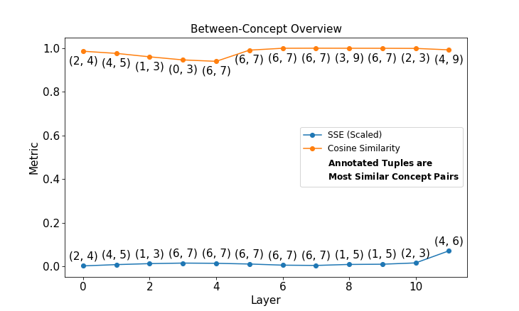
        <figcaption>Most Similar Concept Pairs for SSE (Scaled) and Cosine Similarity across Layers</figcaption>
    </figure>

From the overview plot shown above, it becomes evident that the most similar concept pairs are not constant across different layers and metrics. This observation suggests that the model's understanding and representation of concepts evolve as information passes through successive layers. The variation in most similar concept pairs across layers is expected, as each layer of the ViT processes and refines the input data, capturing different levels of abstraction. While early layers focus more on basic relations, later layers capture more complex relations between the patches leading to shifts in what the model considers "most similar." However, it is noteworthy that, despite these evolving representations, five of the middle layers consistently identify the same concept pair (6, 7), corresponding to the concepts "Garbage Truck" and "Gas Pump," as the most similar when using both SSE and Cosine Similarity. This consistency suggests that the model has reached a stable understanding of these concepts by the middle layers. Once the model has sufficiently abstracted the input data, key distinguishing features become prominent and dominate the similarity assessment.  

One of the last ideas we want to explore is the initial question we wanted to answer at the beginning of this section: *Are the concept embeddings of "Dog" and "Fish" more similar than the concept embeddings of "Dog" and "Truck"?*

    <figure>
        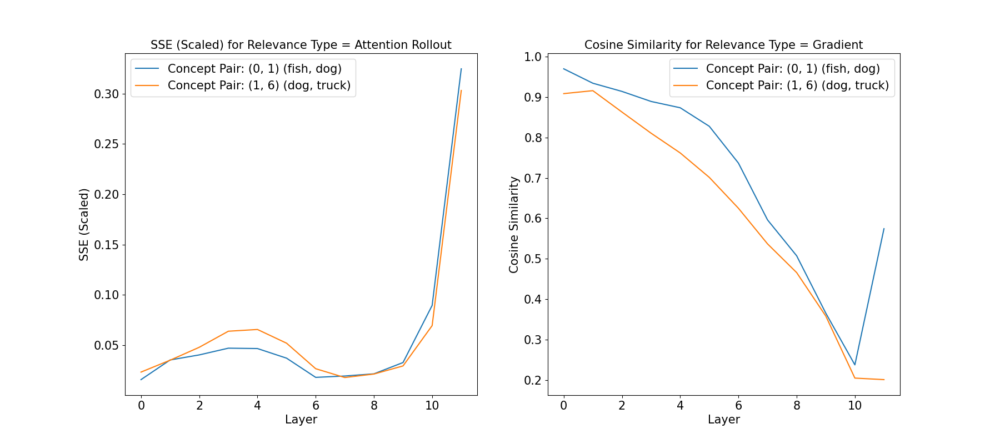
        <figcaption>Comparison of Concept "Dog" & "Fish" and Concept "Dog"  & "Truck"</figcaption>
    </figure>

The two plots above show the distance / similarity between the concept embeddings of "Dog" and "Fish" (blue) and "Dog" and "Truck" (orange). For this experiment, we selected the two best-performing combinations: SSE with Attention Rollout and Cosine Similarity with gradient relevance. In the left plot, we see that the SSE between "Dog" and "Fish" is smaller than the SSE between "Dog" and "Truck" in the earlier layers but gets quite similar in the later layers. On the right, the Cosine Similarity plot shows that "Dog" and "Fish" maintain a higher similarity compared to "Dog" and "Truck." This indicates that the ViT percieves concepts "Dog" and "Fish" as more similar than the concepts "Dog" and "Truck". Thus, we can conclude that our definition of concept embeddings enables us to compare the similarity of concepts with results that agree to our human intuition.

## Sanity Check

Earlier, we explained why and how we select relevant patches from an image of a concept to calculate a representative concept embedding. To ensure that the patch selection approach is valid, we will now conduct some sanity checks. Our described approach always selects the $k=50$ most relevant patches according to a specific relevance definition. In our next experiment, we flip the patch selection to choose the $k=50$ least relevant or just random patches for our concept embeddings.  

Let's first examine the between-concept distance for the concepts "Dog" and "Fish" with the flipped patch selection:

    <figure>
        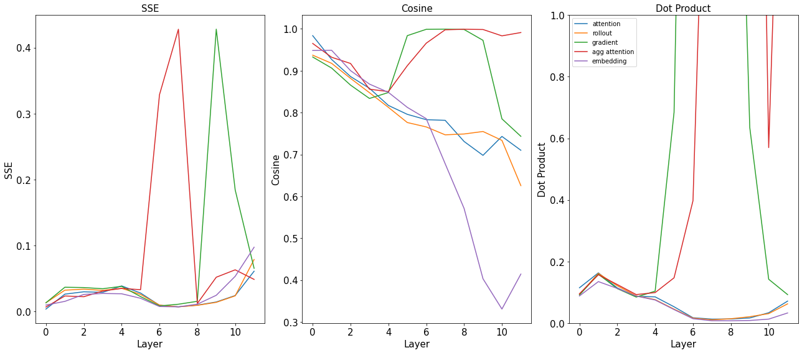
        <figcaption>Scaled Distance Between Concept Embeddings for "Dog" and "Fish" with Flipped Patch Selection</figcaption>
    </figure>

The plots above show that we can still see a small trend of a higher distinguishability in later layers. However, the trend is not as clear as with the original top-k selection, and we can also see outliers for each metric. This makes sense, because here we are looking at the least relevant patches. That means that these patches do not necessarily contain information regarding the specified concept. It could, for example, also be that these concept embeddings only contain information about the background or other random objects in the image. Therefore, the distinguishability between those concept embeddings is not as clear as in our experiments above.  

Let's also analyze the distances/similarities for a random patch selection to calculate the concept embeddings:

    <figure>
        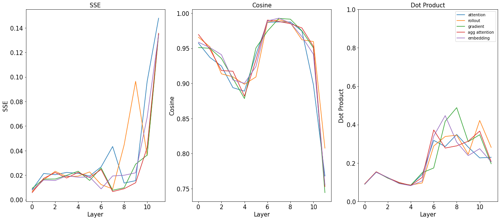
        <figcaption>Distance Between Concept Embeddings for "Dog" and "Fish" with Random Patch Selection</figcaption>
    </figure>

The results are similar to the first sanity check, in which the distinguishability increases with the layers. Again, we can see that the results are not smooth and contain a lot of spikes. Compared to the flipped patch selection, the random patch selection can also select patches with actually relevant information about the concept. Hence, it seems that the distinguishability is slightly better than in the previous experiment.

From both of these experiments, we can conclude that the methodology of selecting patches for the concept embeddings influences the resulting expressiveness. Also, our initial top-k selection provides the most useful and interpretable results.

The final sanity check we want to perform concerns the CLS token that gets concatenated to the sequence of image patch tokens. The ViT uses the CLS token in the end to conduct classification. Therefore, this token should contain the needed discriminative information to distinguish between different classes/concepts. Let's have a look at the distance between the concepts "Dog" and "Fish" and compare the metrics for a concept embedding using all patches (without top-k selection), a variant that uses gradient relevance, and a third variant that uses the average embedding of the CLS token to calculate the metrics.

    <figure>
        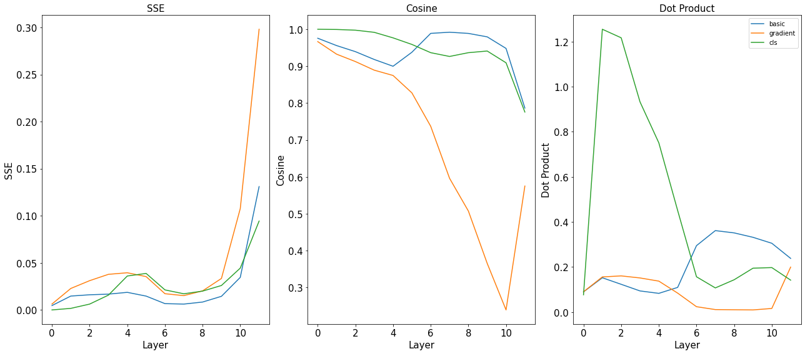
        <figcaption>Comparison of CLS token, gradient relevance & basic concept embeddings</figcaption>
    </figure>

We can see that using the average CLS token to compare concepts performs just as well as using our concept embeddings. Nonetheless, there is a slight difference between e.g. the gradient patch selection and the CLS token. In the later layers, the gradient leads to a higher SSE, and lower Cosine Similarity and Dot Product, which indicates better distinguishability between concepts. The CLS token already performs comparably well because it needs to summarize information to predict the depicted class in an input image. However, the CLS token is not able to store as much information as our concept embeddings, which rely on $k$ tokens/patches. Therefore, our approach to concept embeddings may perform slightly better in distinguishing between two concepts. That's why it makes sense to use the described methodology of concept embeddings for the ViT.

## Conclusion

 At the beginning of our blog post, we described the high need for explainability in increasingly complex models, or so-called "black boxes."
 XAI is needed to gain trust in a model and improve its reliability. One model architecture that stands out as the State-of-the-Art in many
 domains, such as Natural Language Processing, is the Transformer, which has been adapted to Computer Vision in the form of the Vision
 Transformer. While there has already been considerable research on local explanations for ViTs, such as explaining single predictions on an
image, there has been little research concerning global explanations. One approach of global explainability is the idea of analyzing
 representations and examining concepts. This idea is not entirely new; it just has not been exhaustively applied to ViTs yet. That’s why we
 decided to investigate how ViTs represent concepts and whether we can use these representations to distinguish between them in
 alignment with our human intuition.
 For this, we first introduced the idea of calculating concept embeddings and quickly realized the need for a patch selection mechanism. Our
 concept embeddings should focus only on the relevant patches of an image to represent the most crucial features of the concept. Hence,
 we defined patch relevance approaches using raw attention, Attention Rollout, aggregated attention, gradient information and embedding
 value information. Another piece of information we needed to determine was the number of relevant patches to incorporate into our concept
 embeddings. This led us to conduct an occlusion experiment to analyze the performance of a ViT depending on the number of relevant
 patches not masked in the input images. After analyzing the results, we settled on 
k =50
 as the number of selected patches.
 After that, we were able to use our concept embeddings to perform experiments regarding the distance or similarity of concepts. For this,
 we used different metrics: SSE, Cosine Similarity and Dot Product Similarity. During our experiments, we realized that the increasingly
 higher values of the embeddings themselves could influence our results. Therefore, we calculated scaling factors based on the norm of the
 concept embeddings to scale the metric values per layer.
 Consequently, we observed clear trends: 1. The higher the layer, the more different the concept embeddings seem to be; and 2. Our patch
 selection approaches can better distinguish between concepts than an approach without patch selection. The former can be explained by
 the processing of information in a ViT. The concept embeddings start to differ with increasing layer number, because more global
 information can be incorporated into the embeddings. The latter is based on the fact that we focus on the relevant patches using our patch
 selection approaches. Without patch selection, information irrelevant to the concept can influence the distinguishability of concepts.
 To recommend the best combination of distance/similarity metric and patch relevance approach that most effectively distinguishes between
 different concepts, we analyzed the between-concept distances of all possible concept pairs, averaged over the layers, and generated
 boxplots for each metric. The best combinations resulting from this analysis are SSE with Attention Rollout relevance and Cosine Similarity
 with gradient relevance. In addition to this, we also focused on identifying the combination that best captures the highest similarity among
 images of the same concept. By calculating the within-concept distances between all possible image pairs of a concept, averaged over the
 layers and visualized through boxplots, we determined that SSE with gradient relevance and Cosine Similarity with attention relevance are
 most effective for emphasizing the overall similarity within a concept.
 Finally, we validated our approach to calculating concept embeddings by performing several sanity checks. First, we flipped the selection
 of patches to select the 50 most irrelevant patches for a concept, then selected 50 patches randomly, and lastly compared our approach to
 the expressiveness of the CLS token. These experiments showed that our approach of calculating concept embeddings is useful for
 distinguishing between concepts and can also outperform the CLS token.
 The concept embeddings that use patch relevance selection can help us understand the inner workings of a ViT. We can use them to
 analyze how a ViT perceives and represents concepts, and how the increasingly informative embeddings lead to a higher distinguishability
 of concepts. Therefore, concept embeddings can provide insights into the general behaviour of the model and help increase reliability and
 trust in the ViT.
 Nevertheless, there are some limitations to our project findings. Firstly, we only used one specific pretrained ViT model and did not compare
 our findings with results from other models. Secondly, the dataset we used consists of just 10 classes from ImageNet, and we used only the
 first 20 images from each class to calculate the concept embeddings. These 20 images do not necessarily look similar; they are simply
 classified similarly. Therefore, a manual selection of visually similar images of a class could lead to clearer results or trends.
 For future work, it would be interesting to investigate additional information sources to define patch relevance. These new approaches could
 then be compared to our methods to determine whether they can perform better in distinguishing concepts. Furthermore, the concept
 embeddings could be used to find the nearest concept for a query concept. The results could then be visually analyzed to investigate
 whether the similarity aligns with our human intuition. If we extend our work to a larger dataset with more classes and images, manually
 selecting visually similar images of the same class becomes difficult. In such cases, within-concept distances can help select the most
 similar images of a class and discard dissimilar images that may lead to incorrect or contradictory observations.

## References

1. Abnar, S., & Zuidema, W. (2020). Quantifying Attention Flow in Transformers (arXiv:2005.00928). arXiv. http://arxiv.org/abs/2005.00928

2. Bach, S., Binder, A., Montavon, G., Klauschen, F., Müller, K.-R., & Samek, W. (2015). On Pixel-Wise Explanations for Non-Linear Classifier Decisions by Layer-Wise Relevance Propagation. PLOS ONE, 10(7), e0130140. https://doi.org/10.1371/journal.pone.0130140

3. Darcet, T., Oquab, M., Mairal, J., & Bojanowski, P. (2024). Vision Transformers Need Registers (arXiv:2309.16588). arXiv. http://arxiv.org/abs/2309.16588

4. Dosovitskiy, A., Beyer, L., Kolesnikov, A., Weissenborn, D., Zhai, X., Unterthiner, T., Dehghani, M., Minderer, M., Heigold, G., Gelly, S., Uszkoreit, J., & Houlsby, N. (2021). An Image is Worth 16x16 Words: Transformers for Image Recognition at Scale (arXiv:2010.11929). arXiv. http://arxiv.org/abs/2010.11929

5. Dwivedi, R., Dave, D., Naik, H., Singhal, S., Omer, R., Patel, P., Qian, B., Wen, Z., Shah, T., Morgan, G., & Ranjan, R. (2023). Explainable AI (XAI): Core Ideas, Techniques, and Solutions. ACM Computing Surveys, 55(9), 1–33. https://doi.org/10.1145/3561048

6. Kim, B., Wattenberg, M., Gilmer, J., Cai, C., Wexler, J., Viegas, F., & Sayres, R. (2018). Interpretability Beyond Feature Attribution: Quantitative Testing with Concept Activation Vectors (TCAV) (arXiv:1711.11279). arXiv. http://arxiv.org/abs/1711.11279 

7. Kashefi, R., Barekatain, L., Sabokrou, M., & Aghaeipoor, F. (2023). Explainability of Vision Transformers: A Comprehensive Review and New Perspectives (arXiv:2311.06786). arXiv. http://arxiv.org/abs/2311.06786

8. Selvaraju, R. R., Cogswell, M., Das, A., Vedantam, R., Parikh, D., & Batra, D. (2020). Grad-CAM: Visual Explanations from Deep Networks via Gradient-based Localization. International Journal of Computer Vision, 128(2), 336–359. https://doi.org/10.1007/s11263-019-01228-7

9. Shams Khoozani, Z., Sabri, A. Q. M., Seng, W. C., Seera, M., & Eg, K. Y. (2024). Navigating the landscape of concept-supported XAI: Challenges, innovations, and future directions. Multimedia Tools and Applications, 83(25), 67147–67197. https://doi.org/10.1007/s11042-023-17666-y

10. Sundararajan, M., Taly, A., & Yan, Q. (2016). Gradients of Counterfactuals (arXiv:1611.02639). arXiv. http://arxiv.org/abs/1611.02639

11. Vaswani, A., Shazeer, N., Parmar, N., Uszkoreit, J., Jones, L., Gomez, A. N., Kaiser, L., & Polosukhin, I. (2023). Attention Is All You Need (arXiv:1706.03762). arXiv. http://arxiv.org/abs/1706.03762

